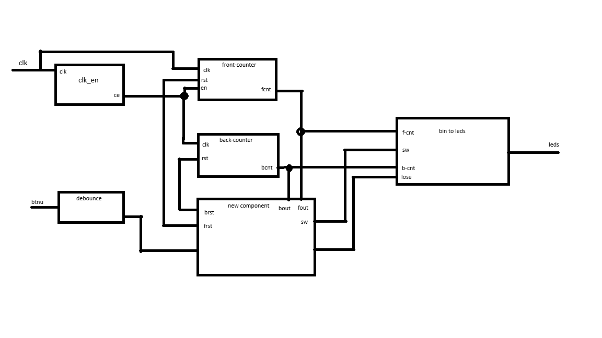
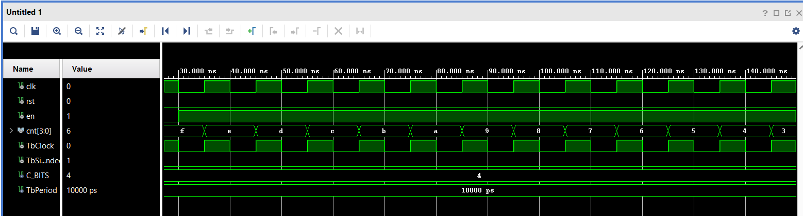
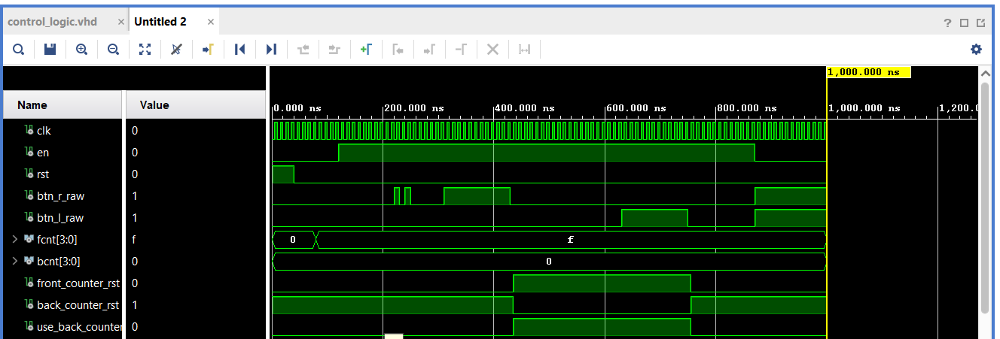

# LED-Ping-Pong-DE1-project
 Digital electronics 1 project, 16-LEd ping-pong game on Nexys-A7-50T FPGa development board

 ## Project Summary
 
 Simulate a bouncing ball with LEDs moving left and right. Update the ball’s position based on button presses and flash LEDs when the player misses.

 ## Top level schematic
 
 

 ## Components
### 1. bin2led
Component bin2led converting binary number to code which turn on only 1 led.

   
 <i>Pic.1 Simulation of bin2led</i>

### 2. front_counter
This component couting input impulses. If on the inputs clk and en are both on high level , then the output signal are increased by 1.
Reset input (rst) are deleted output value and set it to 0.

### 3. reverse_counter
Reverse couter is almost same as front counter except for one change. It counting "back", from 7 to 0. 
 
 <i>Pic.2 Simulation of reverse_counter</i>
 
### 4. control_logic (work in progress)
This is the biggest component of this code. Propouse of this component is switching couters and sensing player imputs. 
When front counter have on output value 7 (witch is maximum output value for this counter) the control logic reset front counter and start
interval during witch user must push button. Result show rgb led (red or green). Next counting back counter and proces repeat. 
 
 <i>Pic.3 Simulation of control_logic</i>

 
 ## Hardware

- Nexys A7-50T
- 16 onboard LEDs
- Push buttons
