# LED-Ping-Pong-DE1-project
Digital Electronics 1 project – 16-LED ping-pong game on the Nexys A7-50T FPGA development board.

## Project Summary

This project implements a Ping-Pong game on the Nexys A7-50T development board. A single LED represents the ball and moves across a 16-LED array. When the ball reaches the edge, the player must press the corresponding button (left button for the left edge, right button for the right edge). If the player presses in time, the green LED lights up and the score increases by 1. If the player misses, the red LED turns on and the game enters GAME_OVER state. The ball speed increases after each successful hit. The score is displayed on the 4-digit 7-segment display in decimal (0000–9999). To restart after game over, both buttons must be pressed simultaneously.

| Signal name | I/O | Size | Note |
| :---: | :---: | :---: | :---: |
| `clk` | input | 1 | system clock (100 MHz) |
| `rst` | input | 1 | system reset (centre button) |
| `btn_r_in` | input | 1 | right button |
| `btn_l_in` | input | 1 | left button |
| `led` | output | 15:0 | LED array (ball position) |
| `led_g` | output | 1 | green LED (successful hit) |
| `led_r` | output | 1 | red LED (miss / game over) |
| `seg` | output | 6:0 | 7-segment display segments |
| `anode` | output | 7:0 | 7-segment display anodes |

<i>Tab.1 I/O table</i>

## [Top level](top.srcs/sources_1/imports/sources_1/new/ping_pong_top.vhd) 
### Schematic
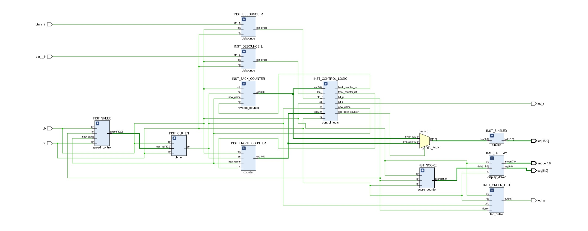

### Components
Used components include: [bin to led](#1-bin2led), [counter](#2-counter), [reverse counter](#3-reverse-counter), [control logic](#4-control-logic), [debounce](#5-debounce), [clk en](#6-clk_en),
[score counter](#7-score-counter), [speed control](#8-speed-control), [led pulse](#9-led-pulse), [display driver](#10-display-driver), [bin to seg](top.srcs/sources_1/imports/sources_1/new/bin2seg.vhd)

### [Testbench:](top.srcs/sim_1/imports/new/tb_ping_pong_top.vhd)

  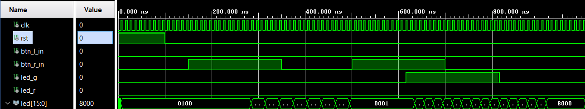 
  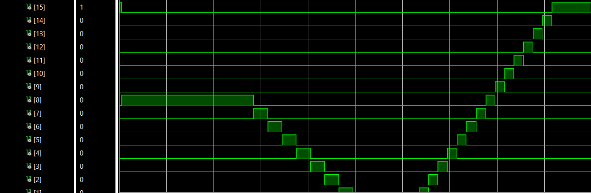 
  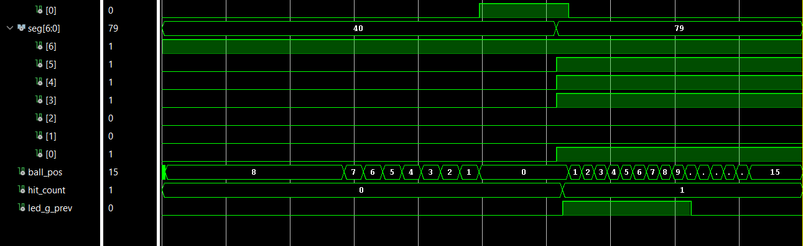 
  <i>Pic.1 Simulation top level</i>

## Components

### [1. bin2led](top.srcs/sources_1/imports/sources_1/new/bin2led.vhd)
Converts a 4-bit binary number to a 16-bit one-hot code – lights up exactly one LED corresponding to the ball position.

[Testbench:](top.srcs/sim_1/imports/new/tb_bin2led.vhd)

  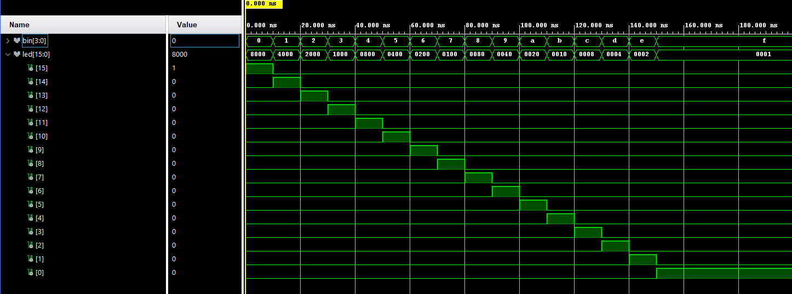 
  <i>Pic.1 Simulation of bin2led</i>

### [2. counter](top.srcs/sources_1/imports/sources_1/new/counter.vhd)
Counts up from 0 to 15 (ball moving right). Resets to 7 (centre) on new game, resets to 0 on normal reset. Saturates at 15.

[Testbench:](top.srcs/sim_1/imports/new/tb_counter.vhd)

  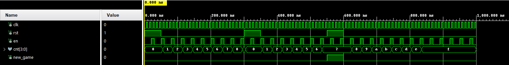 
  <i>Pic.2 Simulation of reverse_counter</i>

### [3. reverse counter](top.srcs/sources_1/imports/sources_1/new/reverse_counter.vhd)
Counts down from 15 to 0 (ball moving left). Resets to 7 (centre) on new game. Saturates at 0.

[Testbench:](top.srcs/sim_1/imports/new/tb_reverse_counter.vhd)

  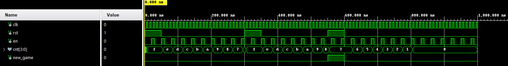 
  <i>Pic.3 Simulation of reverse_counter</i>

### [4. control logic](top.srcs/sources_1/imports/sources_1/new/control_logic.vhd)
Moore FSM with four states: `START → MOVE_RIGHT ↔ MOVE_LEFT → GAME_OVER → START`. Controls which counter is active and which is reset. When the ball reaches an edge, a timer (`sig_cnt`, 0–10) starts counting clock-enable ticks. The player must press the correct button before the timer expires. Outputs `hit_g` on a successful hit and `hit_r` on a miss.

[Testbench:](top.srcs/sim_1/imports/new/tb_control_logic.vhd)

  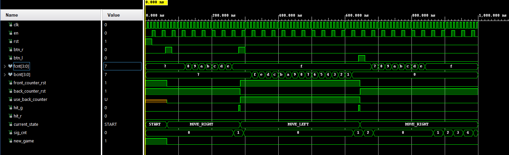 
  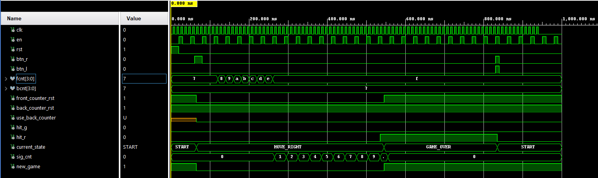 
  <i>Pic.4,5 Simulation of control_logic</i>

### [5. debounce](top.srcs/sources_1/imports/sources_1/new/debounce.vhd)
Two-stage synchroniser with a 4-bit shift register. Eliminates mechanical bounce from button presses and produces a single-cycle `btn_press` pulse on the rising edge.

[Testbench:](top.srcs/sim_1/imports/new/tb_debounce.vhd)

  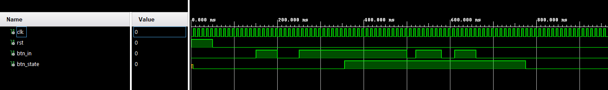 
  <i>Pic.5 Simulation of debounce</i>

### [6. clk en](top.srcs/sources_1/imports/sources_1/new/clk_en.vhd)
Programmable clock divider. Generates a single-cycle clock-enable pulse every `G_MAX` clock cycles. Supports runtime speed override via the `max_val` input port.

[Testbench:](top.srcs/sim_1/imports/new/tb_clk_en.vhd)

  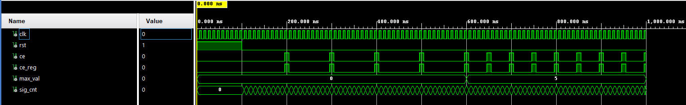 
  <i>Pic.6 Simulation of clk_en</i>

### [7. score counter](top.srcs/sources_1/imports/sources_1/new/score_counter.vhd)
BCD counter for the score. Each successful hit (`hit_g`) increments the score by 1. Each nibble represents one decimal digit (0–9), with carry propagation from ones to tens to hundreds to thousands.

[Testbench:](top.srcs/sim_1/imports/new/tb_score_counter.vhd)

  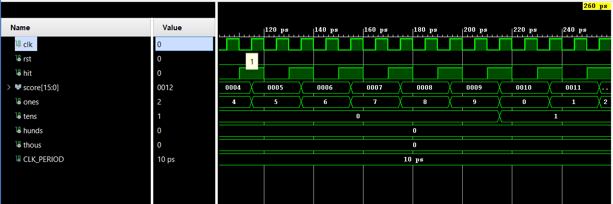 
  <i>Pic.7 Simulation of score_counter</i>

### [8. speed control](top.srcs/sources_1/imports/sources_1/new/speed_control.vhd)
Controls ball speed. Starts at `G_DEFAULT` (7 000 000 clock cycles ≈ 70 ms per step at 100 MHz). After each hit, the speed decreases by ~6.7% (`speed / 15`). Resets to default on new game.

[Testbench:](top.srcs/sim_1/imports/new/tb_speed_control.vhd)

  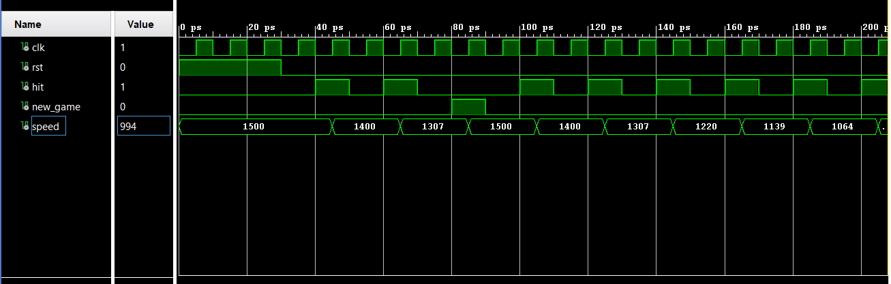 
  <i>Pic.8 Simulation of speed_control</i>

### [9. led pulse](top.srcs/sources_1/imports/sources_1/new/led_pulse.vhd)
Extends a single-cycle trigger pulse into a visible LED blink. Loads a 4-bit counter with 10 on trigger and counts down on each clock-enable tick, keeping the output high until the counter reaches 0. Used for the green hit LED.

[Testbench:](top.srcs/sim_1/imports/new/tb_led_pulse.vhd)

  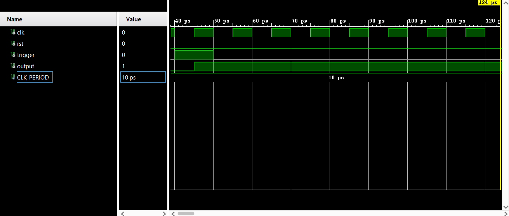 
  <i>Pic.9 Simulation of led_pulse</i>

### [10. display driver](top.srcs/sources_1/imports/sources_1/new/display_driver.vhd)
Multiplexes the 16-bit BCD score across 4 digits of the 7-segment display. Contains its own `clk_en` instance (G_CLK_DIV = 80 000 → ~1.25 kHz refresh rate) and a `bin2seg` decoder for segment encoding.

[Testbench:](top.srcs/sim_1/imports/new/tb_display_driver.vhd)

  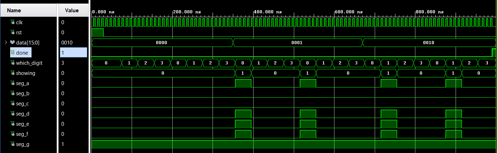 
  <i>Pic.10 Simulation of display_driver</i>

## Hardware

- Nexys A7-50T
- 16 onboard LEDs
- 3 push buttons (left, right, centre for reset)
- 4-digit 7-segment display
- Green and red indicator LEDs
