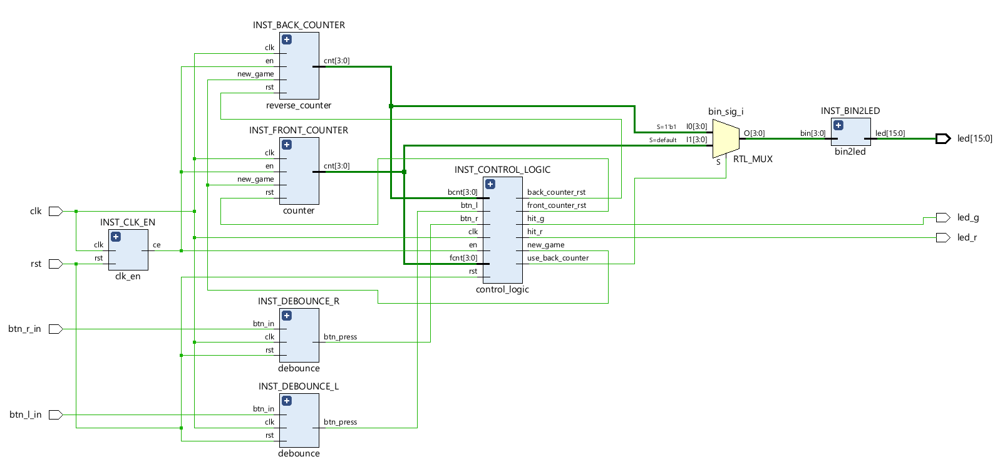
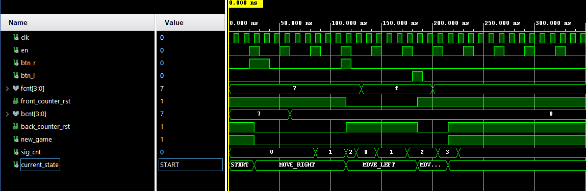

# LED-Ping-Pong-DE1-project
Digital Electronics 1 project – 16-LED ping-pong game on the Nexys A7-50T FPGA development board.

## Project Summary

This project implements a Ping-Pong game on the Nexys A7-50T development board. A single LED represents the ball and moves across a 16-LED array. When the ball reaches the edge, the player must press the corresponding button (left button for the left edge, right button for the right edge). If the player presses in time, the green LED lights up and the score increases by 1. If the player misses, the red LED turns on and the game enters GAME_OVER state. The ball speed increases after each successful hit. The score is displayed on the 4-digit 7-segment display in decimal (0000–9999). To restart after game over, both buttons must be pressed simultaneously.

| Signal name | I/O | Size | Note |
| :---: | :---: | :---: | :---: |
| `clk` | input | 1 | system clock (100 MHz) |
| `rst` | input | 1 | system reset (centre button) |
| `btn_r_in` | input | 1 | right button |
| `btn_l_in` | input | 1 | left button |
| `led` | output | 15:0 | LED array (ball position) |
| `led_g` | output | 1 | green LED (successful hit) |
| `led_r` | output | 1 | red LED (miss / game over) |
| `seg` | output | 6:0 | 7-segment display segments |
| `anode` | output | 7:0 | 7-segment display anodes |

<i>Tab.1 I/O table</i>

## Top level schematic

## Components

### 1. bin2led
Converts a 4-bit binary number to a 16-bit one-hot code – lights up exactly one LED corresponding to the ball position.

   
  <i>Pic.1 Simulation of bin2led</i>

### 2. counter (front_counter)
Counts up from 0 to 15 (ball moving right). Resets to 7 (centre) on new game, resets to 0 on normal reset. Saturates at 15.

### 3. reverse_counter
Counts down from 15 to 0 (ball moving left). Resets to 7 (centre) on new game. Saturates at 0.

   
  <i>Pic.2 Simulation of reverse_counter</i>

### 4. control_logic
Moore FSM with four states: `START → MOVE_RIGHT ↔ MOVE_LEFT → GAME_OVER → START`. Controls which counter is active and which is reset. When the ball reaches an edge, a timer (`sig_cnt`, 0–10) starts counting clock-enable ticks. The player must press the correct button before the timer expires. Outputs `hit_g` on a successful hit and `hit_r` on a miss.

   
  <i>Pic.3 Simulation of control_logic</i>

### 5. debounce
Two-stage synchroniser with a 4-bit shift register. Eliminates mechanical bounce from button presses and produces a single-cycle `btn_press` pulse on the rising edge.

### 6. clk_en
Programmable clock divider. Generates a single-cycle clock-enable pulse every `G_MAX` clock cycles. Supports runtime speed override via the `max_val` input port.

### 7. score_counter
BCD counter for the score. Each successful hit (`hit_g`) increments the score by 1. Each nibble represents one decimal digit (0–9), with carry propagation from ones to tens to hundreds to thousands.

### 8. speed_control
Controls ball speed. Starts at `G_DEFAULT` (7 000 000 clock cycles ≈ 70 ms per step at 100 MHz). After each hit, the speed decreases by ~6.7% (`speed / 15`). Resets to default on new game.

### 9. led_pulse
Extends a single-cycle trigger pulse into a visible LED blink. Loads a 4-bit counter with 10 on trigger and counts down on each clock-enable tick, keeping the output high until the counter reaches 0. Used for the green hit LED.

### 10. display_driver
Multiplexes the 16-bit BCD score across 4 digits of the 7-segment display. Contains its own `clk_en` instance (G_CLK_DIV = 80 000 → ~1.25 kHz refresh rate) and a `bin2seg` decoder for segment encoding.

### 11. bin2seg
Combinational lookup table converting a 4-bit value (0–F) to active-low 7-segment encoding (`seg(6)=g … seg(0)=a`).

## Hardware

- Nexys A7-50T
- 16 onboard LEDs
- 3 push buttons (left, right, centre for reset)
- 4-digit 7-segment display
- Green and red indicator LEDs
